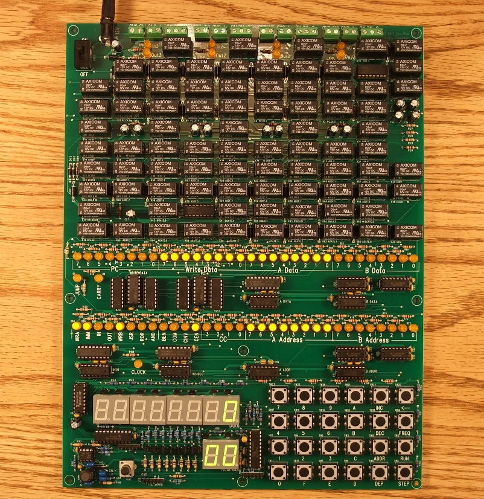

# relaysbc-programs
Programs written for Joe Allen's single board relay computer (sbrc).

This repository contains community contributed programs for the sbrc, as well as a mirror of the sample code, utility programs, and firmware written by Joe Allen.

The original SourceForge project page can be found here: https://sourceforge.net/projects/relaysbc/

An introductory video from Joe Allen can be found here: https://www.youtube.com/watch?v=k1hJoalcK68

[Full size image](sbrc-large.jpg)

## Programs

Community contributed programs are placed in `community/`.

| Program | Author | Description |
| --- | --- | --- |
| [Examples](examples/) | Joe Allen | Example programs and core functions (eg. multiply, divide, sqrt) |
| [Hardware Tests](hardware-tests/) | Joe Allen | Test programs for validating the correct assembly and operation of the computer hardware |
| [Primes](community/primes/) | Ryan Crosby | Prime number search programs |
| [Pi](community/pi/) | Dag Stroman | Calculate the digits of Pi to various accuracies |
| [Tetris](community/tetris/) | Ryan Crosby | A Tetris clone implementation |
| [Util](community/util/) | Ryan Crosby | Miscellaneous utility functions |

## Tools

Tools written in C to support the relay computer.

| Program | Author | Description |
| --- | --- | --- |
| [asm](tools/) | Joe Allen | Assembler for sbrc programs. Produces assembled listing files, which include a memory image that can be sent to the sbrc via serial. |
| [sim](tools/) | Joe Allen | Simulator for the sbrc. Allows testing of programs without access to physical hardware. |

## Firmware

Firmware files for the various microcontrollers included on the sbrc

| Program | Author | Description |
| --- | --- | --- |
| [PIC main](pic/) | Joe Allen | Firmware for the main microcontroller, which orchestrates control of the sbrc. |
| [PIC kbddisp](pic/) | Joe Allen | Firmware for the supplementary microcontroller, which controls the keyboard input and display output. |

## Documentation

| Program | Author | Description |
| --- | --- | --- |
| [docs](docs/) | Joe Allen | Build instructions, BoM, PCB drawings, schematics |
| [refcard](docs/refcard.pdf) | Joe Allen | The reference card for CPU instructions |
| [htdocs](htdocs/) | Joe Allen | HTML documentation including design details and in-depth documentation |
| [OP CODE details](extra-docs/opcodes.md) | Ryan Crosby | Details about each OP CODE flag in the CPU instruction |
| [Extra instructions](extra-docs/extra-instructions.md) | Ryan Crosby | Additional useful instructions not included in the reference card |
| [Magic instructions](extra-docs/magic-instructions.md) | Ryan Crosby | Notes on special instructions trapped by the PIC |

## License

All software is licensed under the GNU GENERAL PUBLIC LICENSE Version 2, June 1991.

See [LICENSE](LICENSE) for details.

## Contributing

Contributions are welcome! Simply fork the project and create a PR with your code, or send/email it to me any way you can and I'll include it in the repo on your behalf.

All contributed code will be licensed (and must comply with) the project license, GPLv2.
