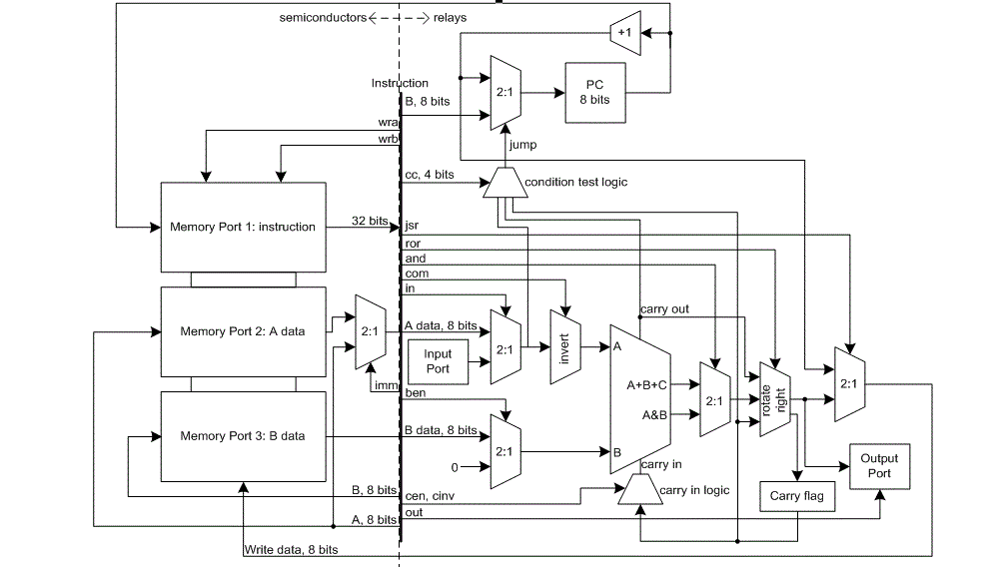

# Extra Instructions
Author: Ryan Crosby

## Preface

The single board relay computer does not use a predefined set of encoded instructions.
Instead, it uses wide instructions with 16 bits worth of bitflags, each of which trigger certain functionality within the CPU and memory controller.
As a result, an instruction decoder is not required, which saves the need for additional relay logic.

An additional benefit of this design is the flexibility it affords in controlling the CPU behaviour.
The instructions listed in the reference card and design documentation are *not* the full exhaustive list of instructions that can possibly be run on the relay computer. In fact, many useful instructions remain "on the table" for use in more advanced scenarios.

This document is an attempt to record some extra, useful instructions, which are not included in the original documentation.

## Instructions

| OP CODE | Mnemonic (unofficial) | Operation |
| --- | --- | --- |
| 0820_aabb | stinc aa bb | [aa] + 1 &rarr; [bb] |
| 8180_aabb | and aa bb | [aa] & [bb] &rarr; [aa] |
| 80D0_aabb | rsbc aa bb | [bb] - [aa] - ~C &rarr; [aa] |
| 81C0_aabb | bic aa bb | ~[aa] & [bb] &rarr; [aa] |
| 8400_aa00 | stjsr aa | PC + 1 &rarr; [aa] |
| 0C00_00bb | stjsrto bb | PC + 1 &rarr; [bb] |

### 0820_aabb: stinc aa bb

Store the value of [aa] + 1 to [bb].

Effectively the same as:

```assembly
st	aa	bb
inc	bb
```

 but saves an instruction.

### 8180_aabb: and aa bb

Computes [aa] & [bb] and stores it in [aa]

This can be useful for performing indirect reads (similar to add), and computing AND at the same time.

```assembly
	st	0x01,	ptr	; Prepare indirect fetch pointer
	st	0xF0,	tmp	; Prepare destination with bitmask
ptr	and	tmp,	0	; AND into tmp
```


### 0C00 00 bb: stjsrto bb

Saves the value of the Program Counter + 1 to [bb].


### 8400 aa 00: stjsr aa

Saves the value of the Program Counter + 1 to [aa].

## Bit reference



| OP CODE | Operation |
| --- | --- |
| 0x00010000 | CC_N |
| 0x00020000 | CC_Z  |
| 0x00040000 | CC_C |
| 0x00080000 | CC_INV |
| 0x00100000 | CEN |
| 0x00200000 |CINV|
| 0x00400000 |COM|
| 0x00800000 |BEN|
| 0x01000000 |AND|
| 0x02000000 |ROR|
| 0x04000000 |JSR|
| 0x08000000 |WRB|
| 0x10000000 |OUT|
| 0x20000000 |IN|
| 0x40000000 |IMM|
| 0x80000000 |WRA|

